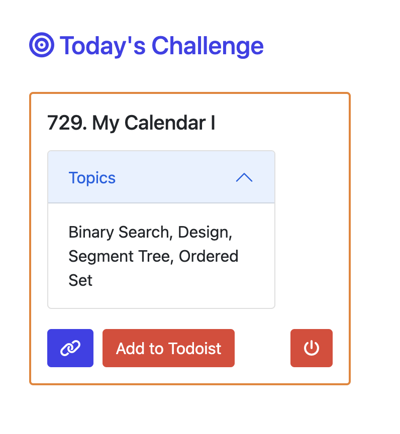
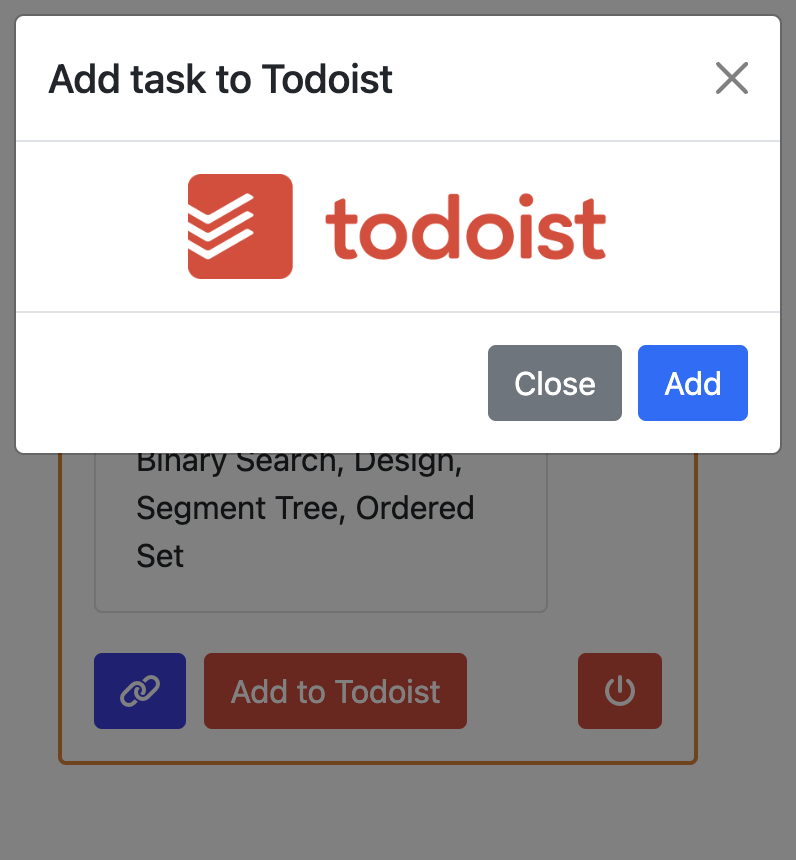
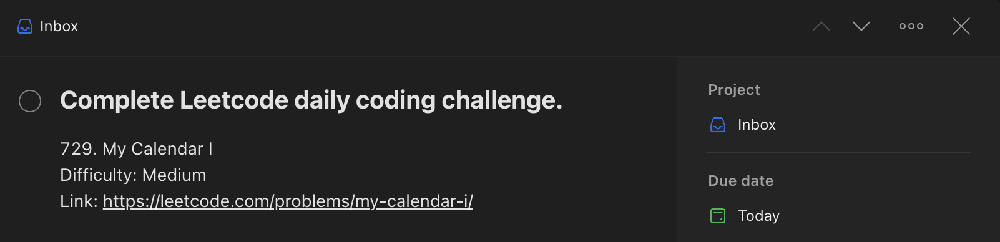

# Grind Leetcode

## About:
**Grind Leetcode** is a Chrome extension where users can retrieve Leetcode's daily coding challenge and optionally add it as a task to their Todoist account. The daily coding challenge is obtained by making requests to Leetcode's public GraphQL API, which can be examined under the Network tab using Chrome's Inspect tool. Users are logged into their Todoist account by the OAuth 2.0 protocol and can choose to add the coding challenge to their Inbox. The daily coding challenge is updated at 12:00 AM (UTC).

 

## Getting Started:
1. Clone this repository:  
`git clone git@github.com:ishuagrawal/Grind-Leetcode.git`
1. Add the project as an extension to your Chrome browser:
   * Click on the triple dots in the top right of the browser and select "More Tools" > "Extensions".
   * Make sure "Developer Mode" is enabled.
   * Click on "Load unpacked" and select the "Grind Leetcode" project.
   * Take note of your Chrome Extension ID (used in Step 3).
2. Setup the Todoist App:
   * Create a new Todoist App by logging into Todoist's [App Management Console](https://developer.todoist.com/appconsole.html).
   * Name the app "Grind Leetcode".
   * For "OAuth redirect URL", enter "https://" + Chrome Extension ID + ".chromiumapp.org/".
   * Take note of your app's Client ID and Client secret (used in Step 4).
3. Update config vars in your project:
   * Go to your project and navigate to `background.js`:
   * Update the `CLIENT_ID` and `CLIENT_SECRET` obtained from your Todoist app settings.
   * Update the `REDIRECT_URI` with the OAuth redirect URL used in your Todoist app.
4. Refresh the extension in the Chrome Extensions page.

 

## Next Steps:
I plan to improve this extension by the following ways: 
* Generate a random Leetcode question that can be filtered by topic and difficulty.
* Display a user's stats of how many questions they completed and his/her current streak.
* Create a personalized study plan of questions based on topics for which the user has low performance.

 

## Screenshots:

